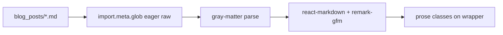

# Markdown blog with Tailwind Typography

## Current state

- [`stitch/src/components/Blog.jsx`](stitch/src/components/Blog.jsx) is a static “Coming Soon” page.
- [`stitch/tailwind.config.js`](stitch/tailwind.config.js) uses `forms` and `container-queries` only; **no** `@tailwindcss/typography` yet.
- [`stitch/package.json`](stitch/package.json) already includes **`gray-matter`** (YAML frontmatter parsing).
- [`stitch/src/App.jsx`](stitch/src/App.jsx) has only `/blog`, no dynamic post route.

## Beginner glossary (plain language)

These terms appear in this plan and in your Markdown files. You do **not** need to memorize them—use this as a cheat sheet.

| Term | Simple meaning |
|------|----------------|
| **Markdown** | A lightweight way to write formatted text using plain characters: `#` for headings, `-` for bullets, `**bold**`, links in `[text](url)`. Your `.md` files are Markdown. |
| **YAML** | A simple format for **settings** written as `key: value` lines. In blog posts, YAML lives at the **top** of the file. |
| **Frontmatter** | The **settings block** at the top of a post, between two `---` lines. It is YAML. The site reads title, date, slug, etc. from here; the rest of the file is your article. |
| **Slug** | The **short name in the website address** for one post. Example: if the slug is `my-first-post`, the URL will look like `/blog/my-first-post`. Use lowercase words separated by **hyphens**, no spaces. Each post needs its **own** slug so two articles do not share one link. |
| **Excerpt** | A **short summary** (one or two sentences) shown on the blog **list** page under the title. People scan it before opening the full post. Same idea as a **blurb** on a book cover. |
| **Blurb** | Informal word for a **short teaser**—here, use the **excerpt** field for that. |
| **Draft** | A post marked as not ready for the public list. When the feature exists, `draft: true` can hide a file until you set it to `false`. |
| **Tags** | Optional **labels** (like “react”, “career”) to group or filter posts later. |
| **Build time** | When you run the production build (or the tool bundles your site), the computer reads all post files once and bakes them into the site. |
| **Glob** | A pattern that means “**all matching files**,” e.g. every `.md` file in one folder. The loader will use this to find posts automatically. |
| **Route** | A **path** in your site’s address bar, like `/blog` or `/blog/hello-world`. |
| **`react-markdown`** | A library that turns Markdown **text** into real page elements (headings, paragraphs, lists) in React. |
| **`remark-gfm`** | Adds **GitHub-style** extras to Markdown: tables, task lists, strikethrough, and more. |
| **Typography plugin / `prose`** | A Tailwind add-on that applies **readable** default styles to article text (spacing, heading sizes, link color) so you do not style every paragraph by hand. |
| **`gray-matter`** | A small helper that **splits** a file into frontmatter (YAML) and body (Markdown) so the app can use both. |

## Content files (what to copy vs what to edit)

| File | Purpose |
|------|---------|
| [`stitch/src/assets/blog_posts/_template.md`](stitch/src/assets/blog_posts/_template.md) | **Master template**—duplicate this when you start a **new** post. Keep the original; do not delete it. The filename starts with `_` so the blog loader can **ignore** this file when listing published posts (implementation detail). |
| [`stitch/src/assets/blog_posts/hello_world.md`](stitch/src/assets/blog_posts/hello_world.md) | **Example published post** with sample body text. Replace the content when you write your real “hello world” article, or use it as a second reference after the template. |

## Architecture

- **Build time:** `import.meta.glob` on `src/assets/blog_posts/*.md` with `{ eager: true, as: 'raw' }`, **excluding** [`_template.md`](stitch/src/assets/blog_posts/_template.md) (or any `_*` pattern) so the template never appears as a live post.
- **Parse:** `gray-matter` → `data` + `content`; read **`slug`** from frontmatter (fallback: derive from filename if desired).
- **Render:** `react-markdown` + `remark-gfm` inside `<article className="prose prose-slate dark:prose-invert ...">`.
- **Tailwind:** extend `theme.extend.typography` for site-consistent link/heading/code styling.

## Frontmatter fields (quick reference)

| Field | Required | Notes |
|-------|----------|--------|
| `title` | Yes | Main headline for the post and listings |
| `date` | Yes | `YYYY-MM-DD` for sorting and display |
| `slug` | Yes | Unique URL piece; see glossary |
| `excerpt` | Yes | Short blurb for the index (not the full article) |
| `draft` | No | Hide from public list when `true` (once implemented) |
| `tags` | No | Optional list of strings |

## Your steps for each new post (beginner checklist)

1. **Copy** [`_template.md`](stitch/src/assets/blog_posts/_template.md) in the same folder.
2. **Rename** the copy to something descriptive, e.g. `learning-typescript.md` (the `.md` ending stays).
3. **Open** the new file and replace the **placeholders** in the top block (`title`, `date`, `slug`, `excerpt`, `tags`). Give this post a **new** `slug` that no other post uses.
4. **Delete** the placeholder paragraphs **below** the second `---` and **write** your article using Markdown.
5. **Save** the file. After the blog is implemented, saving is enough: the build will pick up new files in this folder (you may refresh the dev server or redeploy the site).

You do **not** need to edit React or routing code for every post—only add or edit Markdown files in [`blog_posts/`](stitch/src/assets/blog_posts/).

## Implementation steps

1. **Dependencies:** `@tailwindcss/typography`, `react-markdown`, `remark-gfm`; register plugin in `tailwind.config.js`.
2. **Loader:** `src/data/blogPosts.js` — glob + gray-matter + `getAllPosts()` / `getPostBySlug(slug)`; **skip** `_template.md` (or `_*`).
3. **UI:** `Blog.jsx` post list; new `BlogPost.jsx`; route `/blog/:slug` in `App.jsx`.
4. **Typography:** `prose` wrapper + optional `theme.extend.typography` for primary-colored links and code blocks.

## Files to touch

| Area | Files |
|------|--------|
| Deps | `stitch/package.json` |
| Tailwind | `stitch/tailwind.config.js` |
| Loader | new `stitch/src/data/blogPosts.js` (or similar) |
| Pages | `Blog.jsx`, new `BlogPost.jsx` |
| Router | `App.jsx` |
| Content | `stitch/src/assets/blog_posts/_template.md` (copy from this), `hello_world.md` (sample post) |

## Optional follow-ups

RSS, reading time, syntax highlighting (`rehype-highlight` / Shiki), or hosting `.md` under `public/` for different deployment tradeoffs.
